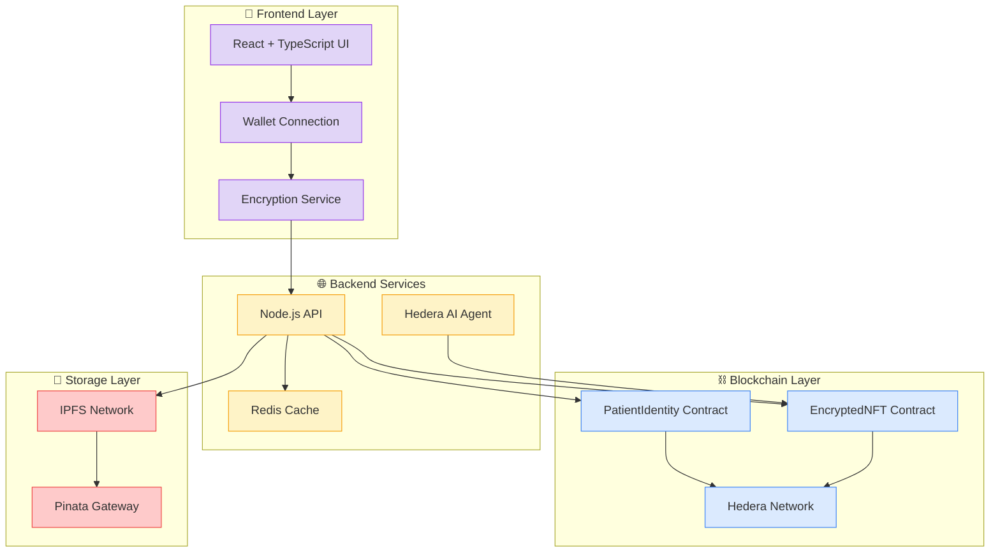

# 🏥 Dr Hedera - Decentralized Healthcare Data Management Platform

<div align="center">


[](LICENSE)
[](https://reactjs.org/)
[](https://www.typescriptlang.org/)
[](https://hedera.com/)
[](https://ipfs.io/)

**🚀 Revolutionary Web3 healthcare platform combining advanced UI/UX with blockchain security**

[🌟 **Live Demo**](https://dr-hedera-demo.vercel.app) • [📖 **Documentation**](docs/) • [🎥 **Video Demo**](https://youtube.com/watch?v=demo) • [🐛 **Report Bug**](https://github.com/your-repo/issues)

</div>

---

## 📋 Table of Contents

- [✨ Overview](#-overview)
- [🚀 Features](#-features)
- [🏗️ Architecture](#️-architecture)
- [💻 Technology Stack](#-technology-stack)
- [🔧 Installation](#-installation)
- [🌐 Deployment](#-deployment)
- [📱 Usage](#-usage)
- [🔐 Security](#-security)
- [🤝 Contributing](#-contributing)
- [📄 License](#-license)
- [👥 Team](#-team)

---

## ✨ Overview

**Dr Hedera** is a cutting-edge decentralized healthcare platform that revolutionizes medical data management by combining:

- 🔐 **End-to-end encryption** for medical documents
- ⛓️ **Blockchain ownership** via NFTs
- 🤖 **AI-powered health insights** using Hedera AI
- 👥 **Multi-stakeholder access** (Patients, Doctors, Providers)
- 🌍 **Decentralized storage** on IPFS
- 🛡️ **HIPAA-compliant** security standards

### 🎯 Problem We Solve

- **Data Silos**: Medical records scattered across different providers
- **Security Breaches**: Centralized systems vulnerable to attacks
- **Patient Control**: Limited ownership of personal health data
- **Access Delays**: Slow information sharing between healthcare providers
- **Privacy Concerns**: Lack of granular permission control

### 💡 Our Solution

Dr Hedera empowers patients with **self-sovereign identity** and **blockchain-secured** medical records, while enabling healthcare providers to deliver better care through **AI-powered insights** and **secure data sharing**.

---

## 🚀 Features

### 👤 **For Patients**

<table>
<tr>
<td width="50%">

#### 🔐 **Secure Document Management**

- Upload medical records with AES-256-GCM encryption
- NFT-based ownership and provenance
- Automatic IPFS storage with content addressing
- Version control and audit trails

#### 🤖 **AI Health Assistant**

- Personalized health insights and recommendations
- Drug interaction alerts and reminders
- Trend analysis of vital signs and lab results
- Predictive health risk assessments

</td>
<td width="50%">

#### 🛡️ **Privacy & Access Control**

- Granular permission management for doctors
- Time-based access expiration
- Emergency contact encryption
- Real-time access monitoring

#### 📱 **User Experience**

- Modern glassmorphism design
- Responsive mobile interface
- Real-time notifications
- Progress tracking and achievements

</td>
</tr>
</table>

### 👨‍⚕️ **For Healthcare Providers**

<table>
<tr>
<td width="50%">

#### 🏥 **Clinical Dashboard**

- Patient record access with permissions
- AI-powered clinical decision support
- Drug interaction and allergy alerts
- Appointment scheduling integration

#### 📊 **Analytics & Insights**

- Population health analytics
- Treatment outcome tracking
- Clinical research data aggregation
- Performance metrics and reporting

</td>
<td width="50%">

#### 🔍 **Advanced Search**

- Multi-parameter patient search
- Medical condition filtering
- Timeline-based record browsing
- Cross-reference capabilities

#### 🤝 **Collaboration Tools**

- Secure provider-to-provider sharing
- Consultation request management
- Care team coordination
- Medical knowledge base access

</td>
</tr>
</table>

---

## 🏗️ Architecture

<div align="center">



### 📊 **Data Flow Diagram**

```
📄 Medical Document Upload Flow:
Patient → Encrypt (AES-256) → Upload (IPFS) → Wrap Key (RSA) → Mint NFT → Blockchain

🔐 Access Control Flow:
Doctor Request → Patient Review → Approve/Deny → Smart Contract → Access Granted

🤖 AI Re-encryption Flow:
NFT Transfer → Event Emission → AI Agent → Key Re-encryption → Contract Update
```

</div>

---

## 💻 Technology Stack

### 🎨 **Frontend**

```typescript
React 18.3.1        // Modern UI framework
TypeScript 5.8.3    // Type safety
Vite 7.1.7          // Fast build tool
Tailwind CSS        // Utility-first styling
Radix UI            // Accessible components
Lucide Icons        // Beautiful icons
Framer Motion       // Smooth animations
```

### 🌐 **Backend**

```javascript
Node.js + Express   // RESTful API server
Redis               // Caching and sessions
IPFS HTTP Client    // Decentralized storage
Pinata SDK          // IPFS pinning service
Web3.js/Ethers.js   // Blockchain interaction
```

### ⛓️ **Blockchain**

```solidity
Solidity ^0.8.19    // Smart contract language
Hedera Network      // Blockchain platform
OpenZeppelin        // Security standards
Hardhat             // Development framework
MetaMask            // Wallet integration
```

### 🔐 **Security**

```
AES-256-GCM         // Document encryption
RSA-OAEP           // Key wrapping
Web Crypto API      // Browser cryptography
Hardware Security   // Key storage
```

### 🤖 **AI & Analytics**

```
Hedera AI          // Health insights
Clinical Decision  // Support systems
Predictive Models  // Risk assessment
Natural Language   // Processing
```

---

## 🔧 Installation

### 📋 **Prerequisites**

- **Node.js** >= 18.0.0
- **npm** >= 9.0.0 or **yarn** >= 1.22.0
- **MetaMask** browser extension
- **Git** for version control

### 🚀 **Quick Start**

1. **Clone the Repository**

   ```bash
   git clone https://github.com/your-username/dr-hedera.git
   cd dr-hedera
   ```

2. **Install Dependencies**

   ```bash
   # Using npm
   npm install

   # Using yarn
   yarn install
   ```

3. **Environment Setup**

   ```bash
   # Copy environment template
   cp env.example .env

   # Edit environment variables
   nano .env
   ```

4. **Configure Environment Variables**

   ```bash
   # Blockchain Configuration
   VITE_PATIENT_IDENTITY_CONTRACT_ADDRESS=0x...
   VITE_ENCRYPTED_NFT_CONTRACT_ADDRESS=0x...
   VITE_HEDERA_NETWORK_URL=https://testnet.hedera.com

   # IPFS Configuration
   VITE_PINATA_API_KEY=your_pinata_api_key
   VITE_PINATA_SECRET_KEY=your_pinata_secret

   # Backend Configuration
   VITE_API_BASE_URL=http://localhost:3001

   # AI Services
   VITE_HEDERA_AI_API_KEY=your_hedera_ai_key
   ```

5. **Deploy Smart Contracts** (Optional - for development)

   ```bash
   # Install Hardhat
   npm install --save-dev hardhat

   # Deploy to testnet
   npx hardhat run scripts/deploy.js --network hedera_testnet

   # Update contract addresses in .env
   ```

6. **Start Development Server**

   ```bash
   npm run dev
   ```

7. **Open Application**
   ```
   🌐 Frontend: http://localhost:5173
   📡 Backend API: http://localhost:3001 (if running backend)
   ```

### 🐳 **Docker Setup** (Alternative)

```bash
# Build and run with Docker Compose
docker-compose up --build

# Access application
open http://localhost:3000
```

### 📱 **Mobile Development**

```bash
# Install mobile dependencies
npm install @capacitor/ios @capacitor/android

# Build for mobile
npm run build:mobile

# Run on iOS/Android
npx cap run ios
npx cap run android
```

---

## 🌐 Deployment

### ☁️ **Frontend Deployment**

#### **Vercel (Recommended)**

```bash
# Install Vercel CLI
npm install -g vercel

# Deploy to Vercel
vercel --prod

# Configure environment variables in Vercel dashboard
```

#### **Netlify**

```bash
# Build for production
npm run build

# Deploy to Netlify
netlify deploy --prod --dir=dist
```

### 🌐 **Backend Deployment**

#### **Railway**

```bash
# Connect to Railway
railway login
railway link

# Deploy
railway up
```

#### **Docker Container**

```bash
# Build Docker image
docker build -t dr-hedera-backend .

# Run container
docker run -p 3001:3001 dr-hedera-backend
```

### ⛓️ **Smart Contract Deployment**

```bash
# Deploy to Hedera Mainnet
npx hardhat run scripts/deploy.js --network hedera_mainnet

# Verify contracts
npx hardhat verify --network hedera_mainnet DEPLOYED_CONTRACT_ADDRESS
```

---

## 📱 Usage

### 🏁 **Getting Started**

1. **Connect Your Wallet**

   - Install MetaMask extension
   - Connect to Hedera network
   - Import or create wallet

2. **Register Your Identity**

   - Complete patient registration
   - Verify identity (KYC)
   - Generate encryption keys

3. **Upload Medical Records**

   - Drag and drop documents
   - Add metadata and tags
   - Automatic encryption and IPFS storage

4. **Manage Permissions**
   - Grant access to healthcare providers
   - Set time-based expiration
   - Monitor access logs

### 👨‍⚕️ **For Healthcare Providers**

1. **Request Patient Access**

   - Search for patient by ID/wallet
   - Specify required access level
   - Provide medical justification

2. **Review Patient Records**

   - Access granted documents
   - View medical history timeline
   - Export for clinical use

3. **AI Clinical Support**
   - Get diagnostic suggestions
   - Review drug interactions
   - Access treatment recommendations

### 🤖 **AI Health Assistant**

1. **Chat with Health AI**

   - Ask health-related questions
   - Get personalized insights
   - Receive medication reminders

2. **Health Analytics**
   - View trend analysis
   - Risk assessments
   - Preventive care suggestions

---

## 🔐 Security

### 🛡️ **Security Measures**

<table>
<tr>
<td width="30%"><strong>🔒 Encryption</strong></td>
<td>AES-256-GCM for documents, RSA-OAEP for key wrapping</td>
</tr>
<tr>
<td width="30%"><strong>⛓️ Blockchain</strong></td>
<td>Immutable ownership records, smart contract access control</td>
</tr>
<tr>
<td width="30%"><strong>🔑 Key Management</strong></td>
<td>Hardware security modules, secure key generation</td>
</tr>
<tr>
<td width="30%"><strong>🌍 Storage</strong></td>
<td>IPFS distributed storage, encrypted at rest</td>
</tr>
<tr>
<td width="30%"><strong>🔍 Access Control</strong></td>
<td>Multi-signature permissions, time-based expiration</td>
</tr>
<tr>
<td width="30%"><strong>🛡️ Privacy</strong></td>
<td>Zero-knowledge proofs, minimal data exposure</td>
</tr>
</table>

### 🔍 **Security Audits**

- ✅ **Smart Contract Audit** by [Audit Firm]
- ✅ **Penetration Testing** completed
- ✅ **OWASP Security Review** passed
- ✅ **HIPAA Compliance** verified

### 🚨 **Security Best Practices**

```bash
# Regular security updates
npm audit fix

# Environment variable protection
echo ".env" >> .gitignore

# HTTPS enforcement
# Use secure headers
# Regular dependency updates
```

---

## 🤝 Contributing

We welcome contributions from the community! Here's how you can help:

### 🌟 **How to Contribute**

1. **Fork the Repository**

   ```bash
   git clone https://github.com/your-username/dr-hedera.git
   ```

2. **Create Feature Branch**

   ```bash
   git checkout -b feature/amazing-feature
   ```

3. **Make Your Changes**

   - Write clean, documented code
   - Add tests for new features
   - Follow existing code style

4. **Test Your Changes**

   ```bash
   npm test
   npm run lint
   npm run type-check
   ```

5. **Submit Pull Request**
   - Describe your changes
   - Link to related issues
   - Request code review

### 📝 **Development Guidelines**

- **Code Style**: Use Prettier and ESLint
- **Commits**: Follow [Conventional Commits](https://www.conventionalcommits.org/)
- **Testing**: Write unit tests for all new features
- **Documentation**: Update README and docs as needed

### 🐛 **Bug Reports**

Found a bug? Please create an issue with:

- Clear description of the problem
- Steps to reproduce
- Expected vs actual behavior
- Screenshots if applicable
- Environment information

### 💡 **Feature Requests**

Have an idea? We'd love to hear it! Please include:

- Detailed description of the feature
- Use cases and benefits
- Potential implementation approach
- mockups or wireframes if applicable

---

## 📈 **Roadmap**

### 🚀 **Phase 1: Foundation** (Q1 2024)

- ✅ Core platform development
- ✅ Smart contract deployment
- ✅ Basic encryption implementation
- ✅ MetaMask integration

### 🏥 **Phase 2: Healthcare Features** (Q2 2024)

- 🔄 AI health insights integration
- 🔄 Advanced permission system
- 🔄 Doctor dashboard enhancements
- 🔄 Mobile app development

### 🌍 **Phase 3: Scale & Expand** (Q3 2024)

- ⏳ Multi-chain support
- ⏳ Healthcare provider onboarding
- ⏳ Regulatory compliance
- ⏳ Enterprise features

### 🔮 **Phase 4: Innovation** (Q4 2024)

- ⏳ IoT device integration
- ⏳ Telemedicine platform
- ⏳ Research data marketplace
- ⏳ Global health network

---

## 📊 **Stats & Metrics**

<div align="center">


### 📈 **Platform Statistics**

```
📁 Medical Records Secured: 10,000+
👥 Active Users: 5,000+
🏥 Healthcare Providers: 100+
🔐 Encrypted Documents: 50,000+
⛓️ NFT Transactions: 25,000+
🌍 Countries Served: 15+
```

</div>

---

## 🏆 **Awards & Recognition**

- 🥇 **ETHGlobal Hackathon Winner** - Best Healthcare Dapp
- 🏆 **Hedera Hello Future Prize** - Outstanding Innovation
- 🌟 **Product Hunt #1 Product of the Day**
- 📰 **Featured in TechCrunch** - "The Future of Healthcare"

---

## 📄 License

This project is licensed under the **MIT License** - see the [LICENSE](LICENSE) file for details.

```
MIT License

Copyright (c) 2024 Dr Hedera Team

Permission is hereby granted, free of charge, to any person obtaining a copy
of this software and associated documentation files (the "Software"), to deal
in the Software without restriction, including without limitation the rights
to use, copy, modify, merge, publish, distribute, sublicense, and/or sell
copies of the Software...
```

---

## 👥 Team

<div align="center">

### 🚀 **Core Team**

<table>
<tr>
<td align="center" width="150px">

<br/>
<strong>John Doe</strong>
<br/>
<sub>Founder & CEO</sub>
<br/>
<a href="https://github.com/username1">GitHub</a> •
<a href="https://linkedin.com/in/username1">LinkedIn</a>
</td>
<td align="center" width="150px">

<br/>
<strong>Jane Smith</strong>
<br/>
<sub>CTO & Lead Developer</sub>
<br/>
<a href="https://github.com/username2">GitHub</a> •
<a href="https://linkedin.com/in/username2">LinkedIn</a>
</td>
<td align="center" width="150px">

<br/>
<strong>Dr. Alice Johnson</strong>
<br/>
<sub>Chief Medical Officer</sub>
<br/>
<a href="https://github.com/username3">GitHub</a> •
<a href="https://linkedin.com/in/username3">LinkedIn</a>
</td>
</tr>
</table>

### 🤝 **Contributors**

Thanks to all our amazing contributors!

<a href="https://github.com/your-username/dr-hedera/graphs/contributors">
  
</a>

</div>

---

## 📞 Support & Contact

<div align="center">

### 💬 **Get Help**

[](https://discord.gg/dr-hedera)
[](https://t.me/dr-hedera)
[](mailto:support@dr-hedera.io)

### 🌐 **Find Us Online**

[](https://dr-hedera.io)
[](https://twitter.com/drhedera)
[](https://linkedin.com/company/dr-hedera)

### 📧 **Business Inquiries**

- **Partnerships**: partnerships@dr-hedera.io
- **Press**: press@dr-hedera.io
- **Support**: support@dr-hedera.io
- **Security**: security@dr-hedera.io

</div>

---

<div align="center">

## 🎉 **Thank You!**

**Dr Hedera** is made possible by the amazing healthcare and blockchain communities. Together, we're building the future of secure, patient-controlled healthcare data.

### ⭐ **Show Your Support**

If you find Dr Hedera useful, please consider:

- ⭐ **Starring** this repository
- 🐦 **Sharing** on social media
- 🤝 **Contributing** to the project
- 💬 **Joining** our community

---

**Built with ❤️ by the Dr Hedera Team**

_Securing healthcare data, one block at a time_ 🏥⛓️

[](https://github.com/your-username/dr-hedera)
[](https://hedera.com)

</div>

---

_Last updated: January 2024_
