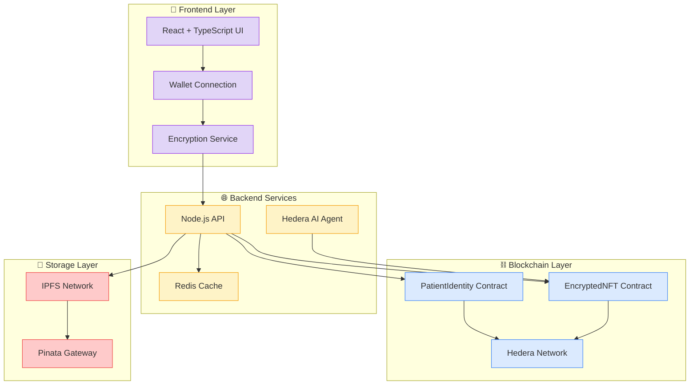

# 🏥 Dr Hedera - Decentralized Healthcare Data Management Platform

<div align="center">


[](LICENSE)
[](https://reactjs.org/)
[](https://www.typescriptlang.org/)
[](https://hedera.com/)
[](https://ipfs.io/)

**🚀 Revolutionary Web3 healthcare platform combining advanced UI/UX with blockchain security**

[🌟 **Live Demo**](https://dr-hedera-demo.vercel.app) • [📖 **Documentation**](docs/) • [🎥 **Video Demo**](https://youtube.com/watch?v=demo) • [🐛 **Report Bug**](https://github.com/your-repo/issues)

</div>

---

## 📋 Table of Contents

- [✨ Overview](#-overview)
- [🚀 Features](#-features)
- [🏗️ Architecture](#️-architecture)
- [💻 Technology Stack](#-technology-stack)

---

## ✨ Overview

**Dr Hedera** is a cutting-edge decentralized healthcare platform that revolutionizes medical data management by combining:

- 🔐 **End-to-end encryption** for medical documents
- ⛓️ **Blockchain ownership** via NFTs
- 🤖 **AI-powered health insights** using Hedera AI
- 👥 **Multi-stakeholder access** (Patients, Doctors, Providers)
- 🌍 **Decentralized storage** on IPFS
- 🛡️ **HIPAA-compliant** security standards

### 🎯 Problem We Solve

- **Data Silos**: Medical records scattered across different providers
- **Security Breaches**: Centralized systems vulnerable to attacks
- **Patient Control**: Limited ownership of personal health data
- **Access Delays**: Slow information sharing between healthcare providers
- **Privacy Concerns**: Lack of granular permission control

### 💡 Our Solution

Dr Hedera empowers patients with **self-sovereign identity** and **blockchain-secured** medical records, while enabling healthcare providers to deliver better care through **AI-powered insights** and **secure data sharing**.

---

## 🚀 Features

### 👤 **For Patients**

<table>
<tr>
<td width="50%">

#### 🔐 **Secure Document Management**

- Upload medical records with AES-256-GCM encryption
- NFT-based ownership and provenance
- Automatic IPFS storage with content addressing
- Version control and audit trails

#### 🤖 **AI Health Assistant**

- Personalized health insights and recommendations
- Drug interaction alerts and reminders
- Trend analysis of vital signs and lab results
- Predictive health risk assessments

</td>
<td width="50%">

#### 🛡️ **Privacy & Access Control**

- Granular permission management for doctors
- Time-based access expiration
- Emergency contact encryption
- Real-time access monitoring

#### 📱 **User Experience**

- Modern glassmorphism design
- Responsive mobile interface
- Real-time notifications
- Progress tracking and achievements

</td>
</tr>
</table>

### 👨‍⚕️ **For Healthcare Providers**

<table>
<tr>
<td width="50%">

#### 🏥 **Clinical Dashboard**

- Patient record access with permissions
- AI-powered clinical decision support
- Drug interaction and allergy alerts
- Appointment scheduling integration

#### 📊 **Analytics & Insights**

- Population health analytics
- Treatment outcome tracking
- Clinical research data aggregation
- Performance metrics and reporting

</td>
<td width="50%">

#### 🔍 **Advanced Search**

- Multi-parameter patient search
- Medical condition filtering
- Timeline-based record browsing
- Cross-reference capabilities

#### 🤝 **Collaboration Tools**

- Secure provider-to-provider sharing
- Consultation request management
- Care team coordination
- Medical knowledge base access

</td>
</tr>
</table>

---

## 🏗️ Architecture

<div align="center">



### 📊 **Data Flow Diagram**

```
📄 Medical Document Upload Flow:
Patient → Encrypt (AES-256) → Upload (IPFS) → Wrap Key (RSA) → Mint NFT → Blockchain

🔐 Access Control Flow:
Doctor Request → Patient Review → Approve/Deny → Smart Contract → Access Granted

🤖 AI Re-encryption Flow:
NFT Transfer → Event Emission → AI Agent → Key Re-encryption → Contract Update
```

</div>

---

## 💻 Technology Stack

### 🎨 **Frontend**

```typescript
React 18.3.1        // Modern UI framework
TypeScript 5.8.3    // Type safety
Vite 7.1.7          // Fast build tool
Tailwind CSS        // Utility-first styling
Radix UI            // Accessible components
Lucide Icons        // Beautiful icons
Framer Motion       // Smooth animations
```

### 🌐 **Backend**

```javascript
Node.js + Express   // RESTful API server
Redis               // Caching and sessions
IPFS HTTP Client    // Decentralized storage
Pinata SDK          // IPFS pinning service
Web3.js/Ethers.js   // Blockchain interaction
```

### ⛓️ **Blockchain**

```solidity
Solidity ^0.8.19    // Smart contract language
Hedera Network      // Blockchain platform
OpenZeppelin        // Security standards
Hardhat             // Development framework
MetaMask            // Wallet integration
```

### 🔐 **Security**

```
AES-256-GCM         // Document encryption
RSA-OAEP           // Key wrapping
Web Crypto API      // Browser cryptography
Hardware Security   // Key storage
```

### 🤖 **AI & Analytics**

```
Hedera AI          // Health insights
Clinical Decision  // Support systems
Predictive Models  // Risk assessment
Natural Language   // Processing
```

---

## 🎉 **Thank You!**

**Dr Hedera** is made possible by the amazing healthcare and blockchain communities. Together, we're building the future of secure, patient-controlled healthcare data.

### ⭐ **Show Your Support**

If you find Dr Hedera useful, please consider:

- ⭐ **Starring** this repository
- 🐦 **Sharing** on social media
- 🤝 **Contributing** to the project
- 💬 **Joining** our community

---

**Built with ❤️ by the Dr Hedera Team**

_Securing healthcare data, one block at a time_ 🏥⛓️

[](https://github.com/your-username/dr-hedera)
[](https://hedera.com)

</div>

---

_Last updated: 28th SEPTEMBER 2025_
